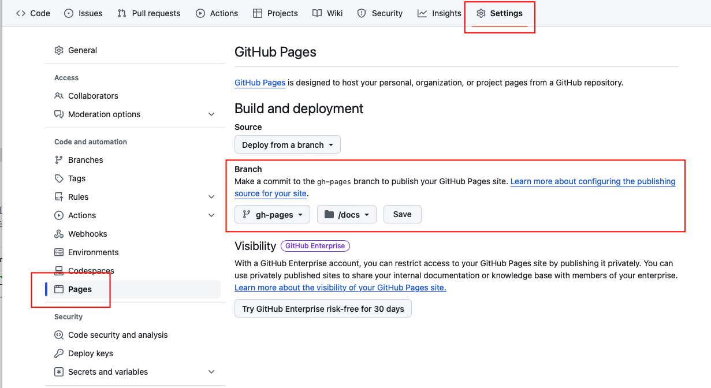

# pyastrosalt

## Installation

```console
pip install pyastrosalt
```

## Development and deployment

[PDM](https://pdm-project.org/en/latest/) is used as the package manager for this project. There are several [ways to install PDM](https://pdm-project.org/en/latest/#installation); one is to use [pipx](https://pipx.pypa.io/stable/).

```bash
pipx install pdm
```

Also, [nox](https://nox.thea.codes/en/stable/index.html) is used as a test runner. It can be installed with pipx.
```bash
pipx install nox
```

### Managing dependencies

 Use PDM's `add` command for adding dependencies. For example:

```bash
pdm add numpy
```

To add an optional dependency, use `-G/--group <name>` option. For example, if you want to add `pyjwt` to the optional group `jwt`:

```bash
pdm add -G pyjwt
```

Optional groups are listed in the `project.optional-dependencies` section of `pyproject.toml`.

In case the dependency is required for development purposes only, you should use the `-dG <name>` option. For example, the following will add pytest to the development only group `test`:

```bash
pdm add -dG test pytest
```

Development only dependency groups are listed in the `tool.pdm.dev-dependencies` section of `pyproject.toml`. They `re not included in the published package.

### Linting and testing

There are some PDM scripts you can use during development, in addition to PDM's own commands.

Script | Description
--- | ---
`lint` | Lint the code. This includes running the precommit and mypy scripts.
`test` | Run the tests (without coverage).
`testcov` | Run the tests (with coverage).
`precommit` | Run pre-commit on all files.
`typecheck` | Run mypy.

You should run `pdm lint` and `pdm test` frequently, ideally before every commit. Before pushing to GitHub, you should run `nox` (with no arguments); this will run the lint and test PDM scripts, using multiple Python versions for the test one. It will also check that the documentation can be generated.

If you want to use [pre-commit](https://pre-commit.com), you can add a git hook for committing by running

```bash
pre-commit install
```

If you don't want to use it any longer, you can remove the git hook again by running

```bash
pre-commit uninstall
```

### Documentation

The documentation is generated using [Materials for MkDocs](https://squidfunk.github.io/mkdocs-material/) and [mkdocstrings](https://mkdocstrings.github.io), and all its files are located in the `/docs` folder. You can view
the generated files by running

```bash
mkdocs serve
```

There also is a pdm script for building the documentation files.

Script | Description
--- | ---
`docs` | Build the documentation

However, contrary to `mkdocs serve`, this command does not let you preview the documentation as you write. It is mostly intended for testing purposes.

### Deployment

There is a GitHub workflow (`publish.xml`) for deploying the package to a package repository (such as PyPI). This workflow assumes that the GitHub repository is a trusted publisher. Refer to the PyPI documentation on how to [create a PyPI project with a trusted publisher](https://docs.pypi.org/trusted-publishers/creating-a-project-through-oidc/).

in addition, the workflow generates the documentation files and publishes them as a GitHub page (at [https://saltastroops.github.io/PyAstroSALT](https://saltastroops.gitub.io/PyAstroSALT)).

To see the deployed documentation, you might have to tweak some settings. Click on Settings in the top menu and then on Page in the sidebar menu. Choose to deploy from a branch, select gh-pages as the branch and / (root) as the folder, and click on the Save button.



The workflow is triggered whenever a release is created for the GitHub repository. The tag for the release must be the package's version number preceded by a "v". For example, if the package version is `"1.4.2"`, the tag must be `"v1.4.2"`. The tag must be for the current commit in the main branch.
