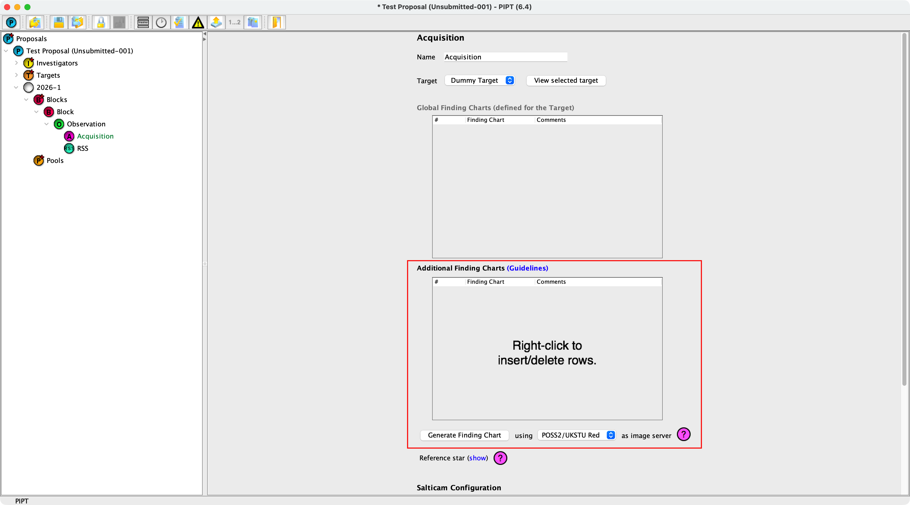
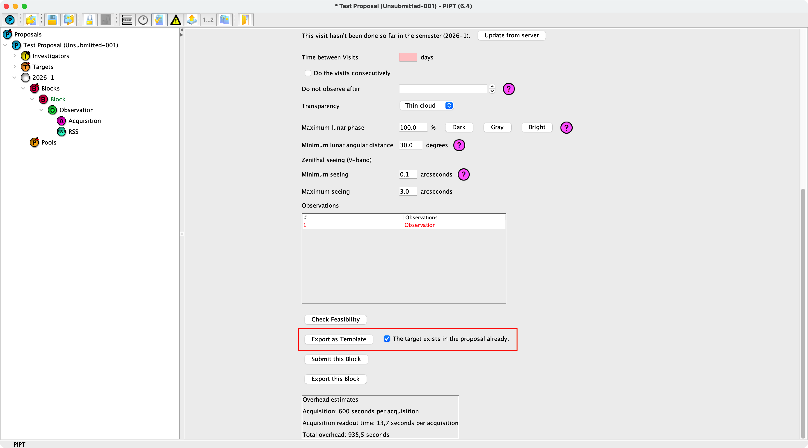

# PyAstroSALT

PyAstroSALT is a wrapper around the RESTful API for observations with the [South African Astronomical Observatory (SALT)](https://www.salt.ac.za/).

It can be used for

* validating proposals
* submitting proposals
* making any API request

## Installation

PyAstroSALT can be installed from PyPI:

```console
pip install pyastrosalt
```

## Validating proposal content

SALT proposal content is stored as zip files, whose content and structure are discussed in the next subsection.

The following assumes that you have a filre `content.zip` with the proposal content to validate in the working directory and that the proposal code is 2026-1-SCI-042.

You start by creating a session and authenticating with your SALT user credentials. For testing, you can use the playground instead of the production server:

```python
from getpass import getpass
from pyastrosalt.session import Session

username = input("Your SALT username: ")
password = getpass("Your SALT password: ")
session = Session()
session.use_playground()
session.login(username=username, password=password)
```

You can now validate the proposal content:

```python
from pyastrosalt.submission import validate

valid, errors = validate(session, "content.zip", "2026-1-SCI-042")
if valid:
    print("The proposal is valid.")
else:
    print("Validation failed with the following error(s):")
    for error in errors:
        print(f"- {error}")
```

### Creating a zip file with proposal content

While in principle PyAstroSALT _can_ be used to submit entire proposals, this is not the intended use really - use the [PIPT](https://astronomers.salt.ac.za/software/pipt/) instead. But if you wanted to submit whole proposals, here is a recipe:

1. Create a proposal in the PIPT.
2. Export the proposal as a zip file (using the menu option File | Export as Zip File...).
3. Look at the exported file to see what the proposal content file would have to look like.

In this section we discuss the case of submitting one or several blocks for an existing proposal code, assuming that the corresponding targets do not exist in the proposal already.

The first step is to create a block in the PIPT which looks as similar as possible to the ones you are planning to submit later on. If you want to add a finder chart of your own, make sure you add or generate a finder chart to the block on its Acquisition tab.



Make sure the proposal with the block is valid (using the menu item Proposal | Validate). Then go to the Block tab and scroll to the bottom. Unselect the checkbox about an existing target and export the block as a template by clicking the respective button. (You may choose `.txt` or `.xml` as the file extension.)



The content of the exported file looks like the following:

```xml
<Block>
    <Name>---INSERT NAME---</Name>  
    <BlockCode>a88af68c-2347-4274-9b4b-1e1a9da6d790</BlockCode>
    ... many more elements ...
</Block>
```

The following details need to be modified:

* The various instances of the string `---INSERT NAME---` must be replaced with a meaningful name. Note that block names and target names must be unique within a proposal.
* The content of the `BlockCode` element must be replaced with a completely random string.
* The `id` attribute value of the `Target` element must be replaced with a completely random string.
* The content of the `TargetCode` element must be replaced with a completely random string.
* Update the other target details as required.

If you are including a finder chart, you also have to replace the content of the `Path` element with the string `Included/<filename>`, where `<filename>` is the filename of your finder chart.

Surround the resulting string with `<Blocks>` and `</Blocks>`, and save the result in a file `Blocks.xml`. (If you wanted to submit multiple blocks, the `Blocks` element would have a `Block` child for each of your blocks.)

Now create a directory `Included`. If you have a finder chart, move it into this directory.

Finally, create a zip file with `Blocks.xml` and `Included`. This is the file to submit.

The following example illustrates how you may create a file with proposal content with a Python script:

```python
# Simple example of creating a zip file with block content.
#
# Assumptions:
# - There exists a file BlockTemplate.xml in the working directory, as exported from the
#   PIPT.
# - The target name in this file is Dummy Target.
# - There exists a finder chart called FinderChart.pdf in the working directory.
# - There exists no file content.zip in the working directory.
#
# You may have to tweak this example to fit your use case!

import dataclasses
import pathlib
import re
import zipfile
from typing import Literal
from uuid import uuid4


@dataclasses.dataclass()
class Target:
    name: str
    ra_hours: int
    ra_minutes: int
    ra_seconds: float
    dec_sign: Literal["+", "-"]
    dec_degrees: int
    dec_arcminutes: int
    dec_arcseconds: float
    min_magnitude: float
    max_magnitude: float


def main():
    """Create the content zip file."""
    # Collect the data for the new block.
    target = Target(
        name="Example Target 2",
        ra_hours=7,
        ra_minutes=8,
        ra_seconds=9.1,
        dec_sign="-",
        dec_degrees=-50,
        dec_arcminutes=6,
        dec_arcseconds=16.8,
        min_magnitude=18,
        max_magnitude=18,
    )
    finder_chart = pathlib.Path("FinderChart.pdf")
    finder_chart = None  # Comment this line out if there is a finder chart.

    # Get the template and make the necessary modifications.
    block_template = pathlib.Path("BlockTemplate.xml")
    block = block_template.read_text()
    block = modify_block(block, target, finder_chart)

    # Create the zip file to submit.
    blocks = f"<Blocks>\n{block}\n</Blocks>"
    content = pathlib.Path("content.zip")
    if content.exists():
        raise IOError(f"The output file ({content.absolute()}) exists already.")
    with zipfile.ZipFile(content, "w") as archive:
        archive.writestr("Blocks.xml", blocks)
        if finder_chart:
            archive.write(finder_chart, f"Included/{finder_chart.name}")


def modify_block(block: str, target: Target, finder_chart: pathlib.Path | None):
    """Update the block template."""
    block = block.replace(
        "<Name>---INSERT NAME---</Name>", f"<Name>{target.name}</Name>"
    )
    block = re.sub(
        r"<BlockCode>[^<]*</BlockCode>", f"<BlockCode>{uuid4()}</BlockCode>", block
    )
    block = re.sub(r'<Target id="[^"]*">', f'<Target id="{uuid4()}">', block)
    block = re.sub(
        r"<TargetCode>[^<]*</TargetCode>", f"<TargetCode>{uuid4()}</TargetCode>", block
    )
    block = block.replace("<Name>Dummy Target</Name>", f"<Name>{target.name}</Name>")
    if finder_chart:
        block = block.replace(
            "<Path>---INSERT ABSOLUTE FILE PATH OR auto-generated---</Path>",
            f"<Path>Included/{finder_chart.name}</Path>",
        )
    return block


if __name__ == "__main__":
    main()

```

## Submitting a proposal

As in the previous section, the following example assumes that you have a filr `content.zip` with the proposal content to submit in the working directory and that the proposal code is 2026-1-SCI-042.

If you want to submit the proposal, you start by creating a session and authenticating. For testing, you can use the playground instead of the production server:

```python
from getpass import getpass
from time import sleep

from pyastrosalt.session import Session

username = input("Your SALT username: ")
password = getpass("Your SALT password: ")
session = Session()
session.use_playground()
session.login(username=username, password=password)
```

You can now call the `submit` function. This function takes a zip file with the proposal content (as explained above) and the proposal code (or `None` if a competely new proposal is submitted), and it returns a `Submission` instance, which you can poll for the submission status, proposal code and (if applicable) submission error:

```python
from time import sleep
from pyastrosalt.submission import submit, SubmissionStatus

submission = submit(
    session, "content.zip", "2026-1-SCI-042"
)
while submission.status == SubmissionStatus.IN_PROGRESS:
    print("Waiting for submission to finish...")
    sleep(10)
    
if submission.status == SubmissionStatus.SUCCESS:
    print(f"Success! The proposal code is {submission.proposal_code}.")
else:
    print(f"The validation failed with the following error:\n{submission.error}")
```

## Using the SALT API

To make a request to the SALT API, you can create a session, authenticate and issue an HTTP request. Refer to the [Requests documentation](https://requests.readthedocs.io/en/latest/) for details on the available request methods (`get`, `post`, `put`, `patch`, `delete` and `request`).

The following example shows how you can get details about your SALT propoals:

```python
from getpass import getpass

from pyastrosalt.session import Session

# Get a session and authenticate
username = input("Your SALT username: ")
password = getpass("Your SALT password: ")
session = Session()
session.use_playground()
session.login(username=username, password=password)

# Make the API request
response = session.get("/proposals/")
if not response.ok:
    raise Exception("The API request failed.")

# Use the response from the API
proposals = response.json()
for proposal in proposals:
    print(f"{proposal['proposal_code']}: {proposal['title']}")
```

You can find the available API endpoints on the [SALT API documentation page](https://api-playground.salt.ac.za/docs).
